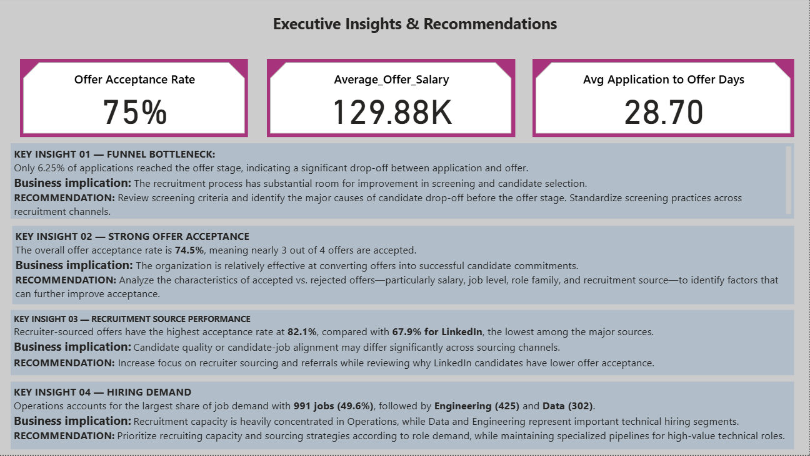

# US-IT-Recruitment-Analytics-SQL-Python-Excel-Power-BI
End-to-end US IT recruitment analytics project using SQL, Python, Excel, and Power BI to analyze recruitment funnels, sourcing performance, hiring demand, offer acceptance, and recruitment efficiency.

## 📌 Project Overview

An end-to-end recruitment analytics project designed to analyze
candidate applications, recruitment sources, interview outcomes,
offers, offer acceptance, job demand, and recruitment efficiency
for a US IT staffing company.

## 🎯 Business Problem

Recruitment management lacked a centralized analytical view of
the recruitment funnel and struggled to identify bottlenecks,
high-performing sourcing channels, hiring demand, and offer
acceptance patterns.

## 🎯 Business Objectives

- Analyze recruitment funnel performance
- Identify effective recruitment sources
- Analyze job and candidate demand
- Evaluate offer acceptance
- Analyze recruitment efficiency
- Provide actionable business recommendations

## 🛠️ Tools & Technologies

- Excel
- Python
- MySQL
- Power BI

## 📊 Dataset

Synthetic US IT recruitment dataset containing:

- 9,000 candidates
- 2,000 jobs
- 320 companies
- 15,000 applications
- 7,196 interviews
- 938 offers

## 🔄 Project Workflow

Raw Data
↓
Data Quality Audit
↓
Data Cleaning
↓
Data Validation
↓
SQL Analysis
↓
Python EDA
↓
Power BI Dashboard
↓
Business Insights
↓
Recommendations

## 📈 Key Insights

- 938 offers were generated from 15,000 applications.
- Overall offer acceptance rate was 74.5%.
- Recruiter-sourced offers had the highest acceptance rate.
- Operations represented the largest hiring demand.
- Average application-to-offer time was approximately 28.7 days.
- Senior-level offers had higher average salaries than junior and
  mid-level positions.

## 📊 Power BI Dashboard

[Dashboard screenshots here]

## 💡 Business Recommendations

1. Improve screening processes to reduce application-stage drop-off.
2. Increase focus on high-performing recruitment sources.
3. Investigate low offer acceptance from LinkedIn.
4. Align recruiting capacity with high-demand role families.
5. Monitor application-to-offer turnaround time.

## ⚠️ Limitations

- Dataset is synthetic.
- Recruiter-level performance data was unavailable.
- Application stage represents the current stage rather than a
  complete historical stage progression.
- Application-to-offer time should not be interpreted as true
  time-to-hire because joining/placement dates were unavailable.

## 📊 Power BI Dashboard

### 1. Recruitment Overview
()

### 2. Recruitment Performance
()

### 3. Job & Candidate Analysis

### 4. Executive Insights & Recommendations

---

## 🔍 Key Insights

- 15,000 applications were analyzed across 2,000 job openings.
- 938 offers were generated, with an overall offer acceptance rate of 74.5%.
- Recruiter-sourced candidates had the highest offer acceptance rate at 82.1%.
- Operations represented the largest hiring demand with 991 job openings.
- Average application-to-offer time was approximately 28.7 days.
- Average offer salary was approximately $129.9K.

---

## 💡 Business Recommendations

- Improve screening processes to reduce candidate drop-off.
- Increase focus on high-performing recruitment sources.
- Investigate lower offer acceptance from LinkedIn.
- Align recruiting capacity with high-demand role families.
- Monitor application-to-offer turnaround time.

---

## ⚠️ Limitations

- The dataset is synthetic and privacy-safe.
- Recruiter-level performance data was not available.
- Application stage represents the current stage rather than a complete historical funnel.
- Application-to-offer time is not true time-to-hire because placement/joining dates were unavailable.

---

## 👤 Author

**Anand Mehto**

Aspiring Data Analyst | SQL | Python | Excel | Power BI
